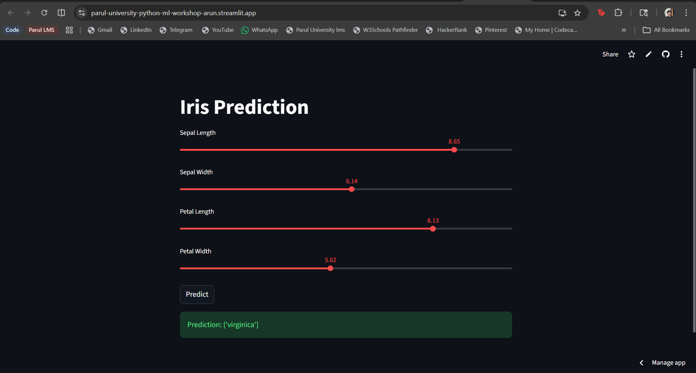

# 🌸 Iris Flower Prediction Web App

A simple **Machine Learning web application** that predicts the species of an Iris flower based on user input.

This project was created during a **Python to Machine Learning Workshop at Parul University**.
It demonstrates the full workflow from **model training → saving the model → building a web app → deploying it online**.

---

# 🚀 Live Demo

🔗 **Streamlit App**

https://parul-university-python-ml-workshop-arun.streamlit.app/

---

# 📊 What This Project Does

The app predicts the **species of an Iris flower** using four features:

* Sepal Length
* Sepal Width
* Petal Length
* Petal Width

The machine learning model predicts one of these species:

* Setosa
* Versicolor
* Virginica

Users can adjust the values using sliders and instantly see the prediction.

---

# 🧠 Machine Learning Workflow

This project follows a simple ML pipeline:

1. Load dataset using **pandas**
2. Split dataset into training and testing data
3. Train model using **RandomForestClassifier**
4. Evaluate the model
5. Save the trained model using **pickle**
6. Build an interactive UI using **Streamlit**
7. Deploy the web application

---

# 📂 Project Structure

```
irisapp
│
├── screenshots
│   └── iris-prediction-webapp.png
│
├── iris.csv
├── model_svm.pkl
├── requirements.txt
├── webapp.py
│
└── README.md
```

---

# 🖥️ Application Screenshot



The user can adjust flower measurements and click **Predict** to see the predicted species.

---

# ⚙️ Technologies Used

Programming Language

* Python

Libraries

* pandas
* scikit-learn

Web Framework

* Streamlit

Tools

* Google Colab
* GitHub

---

# 🔬 Machine Learning Model

Algorithm Used

RandomForestClassifier

Dataset Used

Iris Dataset

Model Evaluation Metrics

* Precision
* Recall
* F1 Score
* Accuracy

The trained model is saved as:

```
model_svm.pkl
```

and loaded in the Streamlit web app.

---

# 💻 Run Project Locally

Clone the repository

```
git clone https://github.com/mrarunkumar18/irisapp.git
```

Go to the project folder

```
cd irisapp
```

Install dependencies

```
pip install -r requirements.txt
```

Run the app

```
streamlit run webapp.py
```

---

# 🔗 Important Links

Live App
https://parul-university-python-ml-workshop-arun.streamlit.app/

GitHub Repository
https://github.com/mrarunkumar18/irisapp

Streamlit
https://streamlit.io/

Scikit-learn
https://scikit-learn.org/

Pandas
https://pandas.pydata.org/

---

# 📚 What I Learned

* Machine learning basics
* Model training using scikit-learn
* Saving ML models using pickle
* Building web apps with Streamlit
* Deploying ML apps online

---

# 👨‍💻 Author

**Arun Kumar**

BCA Student
Parul University

GitHub
https://github.com/mrarunkumar18
